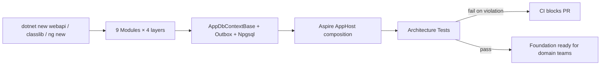
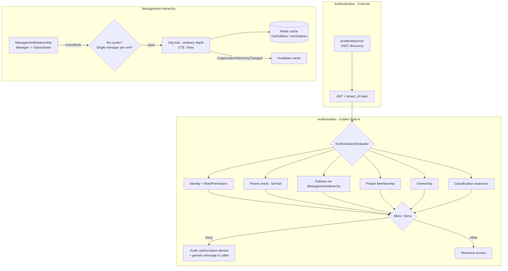
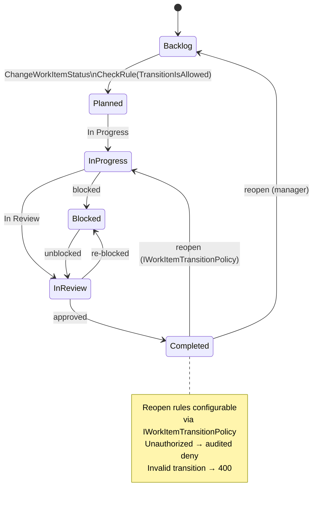
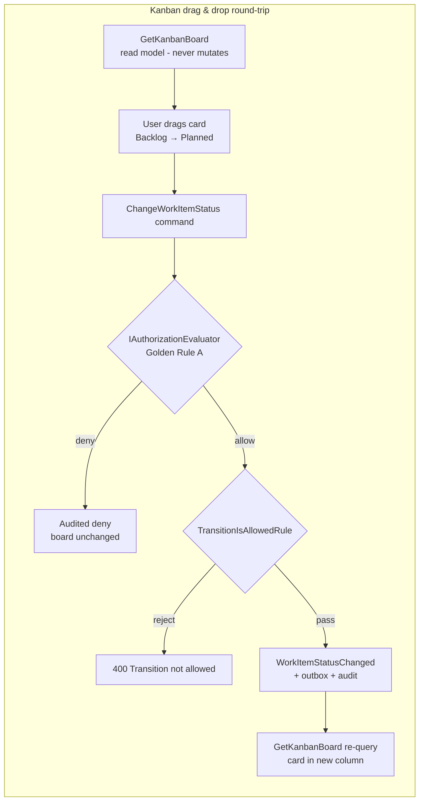
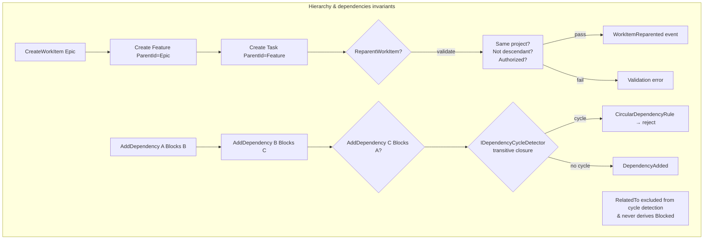
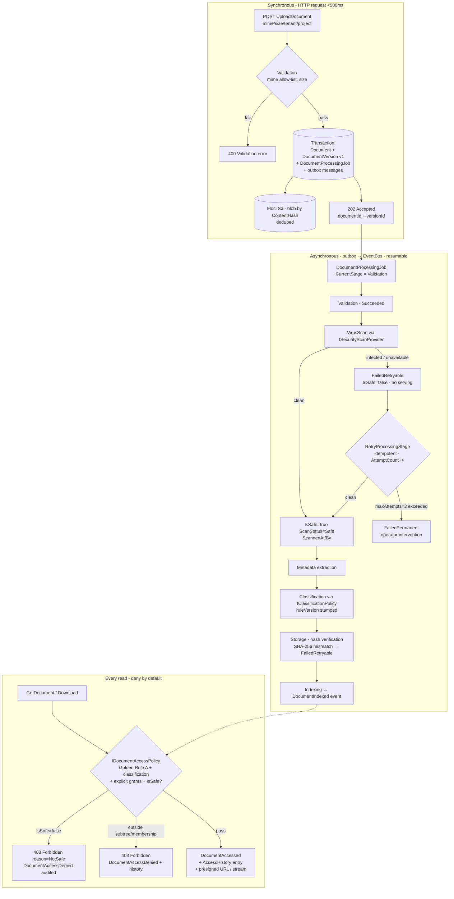
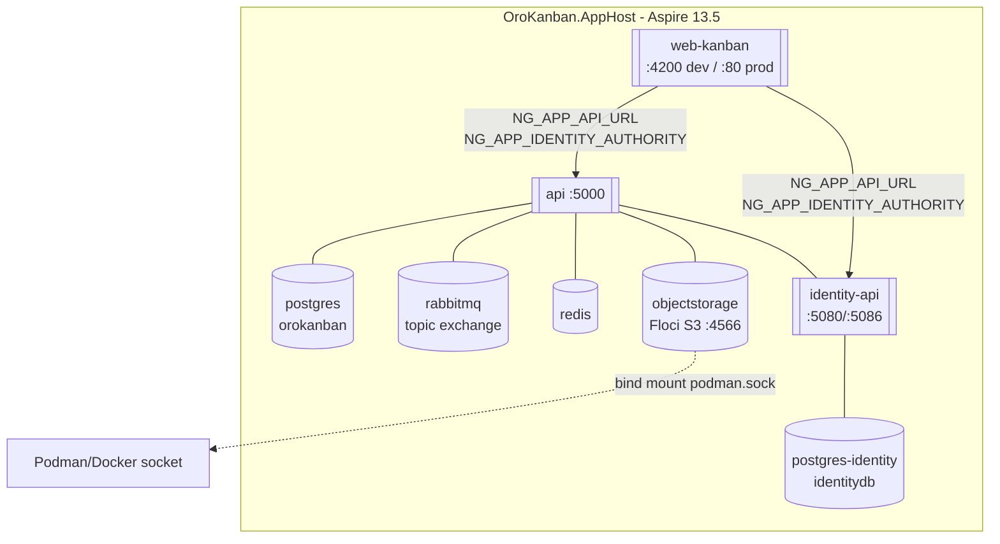

# OroKanban

> **Multi-tenant** Kanban project management platform — distributed with **.NET Aspire**, **CQRS + DDD** and **Vertical Slice Architecture**.

OroKanban is not just another board. It is an enterprise platform where every change is **auditable**, every AI decision is **traceable** with *human-in-the-loop*, every document has a **lifecycle and classification**, and every data access respects **Golden Rule A** (Identity + Role/Permission + Tenant + Management Subtree + Project Membership + Ownership + Classification).

> **License:** Proprietary — Copyright (c) 2026 Oscar Rojas — All rights reserved. See [LICENSE](./LICENSE). No use, copy, modification, or distribution is permitted without prior written authorization.

---

## Table of Contents

- [Key Features](#key-features)
- [Functionality by Bounded Context](#functionality-by-bounded-context)
- [Advantages](#advantages)
- [Use Cases](#use-cases)
- [Architecture](#architecture)
- [Tech Stack](#tech-stack)
- [Project Structure](#project-structure)
- [Requirements](#requirements)
- [Getting Started](#getting-started)
- [Verification & Health](#verification--health)
- [Useful Scripts](#useful-scripts)
- [Design Decisions](#design-decisions)
- [Additional Documentation](#additional-documentation)
- [License](#license)

---

## Key Features

| Feature | Description |
|---|---|
| **Native multi-tenant** | `tenant_id` from external OIDC (`oroidentityserver`). 404-shadow isolation, pre-fetch filtering, zero cross-tenant leakage. |
| **Enterprise Kanban** | Status-driven board (`Backlog → Planned → In Progress → Blocked ↔ In Review → Completed`), swimlanes, filters, WIP, drag & drop validated by a **domain state machine** (`CheckRule(TransitionIsAllowedRule)`). |
| **Arbitrary-depth hierarchy** | `WorkItem.ParentId` self-reference → `Epic → Feature → Task → Subtask` with no depth limit. Reparenting only via `ReparentWorkItem` with cycle validation. |
| **Dependencies with cycle detection** | `WorkItemDependency` (`Blocks`/`BlockedBy`/`DependsOn`/`RelatedTo`) + transitive `IDependencyCycleDetector`. `RelatedTo` never derives blocking. |
| **Golden Rule A assignment** | `AssignWorkItem` requires active assignee + non-completed item + (inside assigner's subtree **or** shared project membership). |
| **Explainable metrics & progress** | Versioned `MetricDefinition`, weights 0–1, formula `Σ(progress×weight)/Σ(weight)`, persisted deterministic `ProgressExplanation`. Never an arbitrary number. |
| **First-class document management** | `Document` + per-version immutable `DocumentVersion` (SHA-256 hash, metadata snapshot), resumable pipeline `Upload → Validation → VirusScan → Metadata → Classification → Storage → Indexing` via `DocumentProcessingJob`. |
| **Hash-based storage** | Binaries in **Floci (S3-compatible)** via Aspire (`objectstorage:4566`). DB stores metadata only. Deduplication by `ContentHash`, presigned URLs, `IsSafe=true` required before serving. |
| **Traceable AI document intelligence** | `LlmOperation` + `LlmResult` + immutable `LlmPromptVersion` + mandatory `Provenance` (document, version, model, prompt, actor, quality). RAG with **authorized pre-filtering** before vector ranking. |
| **Human Review Gate** | `IReviewPolicy` decides `PendingReview` by `OperationType × Classification`. No authoritative data is overwritten without explicit approval. |
| **Append-only audit** | Immutable `AuditEntry` (no `Update`/`Delete`), optional hash chaining, `SearchAuditEntries` / `GetAuditTrail` / `GetOperationTimeline(correlationId)` filtered by Golden Rule A. |
| **Decoupled notifications** | Generated only from **IntegrationEvents**, deduped by `eventId+recipient`, fanned out per channel (`InApp` guaranteed, `Email` extensible), user preferences vs organizational policy. |
| **Real-time** | SignalR hubs (`/hub`, `/hubs`) for board and notifications. |
| **Observability** | `BuildingBlocks.ServiceDefaults`: OpenTelemetry (logs/traces/metrics + OTLP), `/health` (per-dependency readiness) / `/alive` (liveness), structured Serilog, HTTP resilience. Native Aspire dashboard. |

---

## Functionality by Bounded Context

### BC-10 Platform / Foundation (`001`)

Skeletons for 9 modules (Domain/Application/Infrastructure/Contracts), `AppDbContextBase` + outbox + Npgsql + optimistic concurrency, dev-only `SeedDevelopmentData` via Identity admin APIs, composite `GetPlatformHealth`, and **Architecture Tests** that forbid MediatR/MassTransit/AutoMapper and cross-module Infrastructure/Domain references.



### BC-01 Identity & BC-02 Organization (`002`)

- Auth 100% delegated to **oroidentityserver** (OIDC authorization_code + refresh), validated against `/.well-known/openid-configuration`, claims `sub`, `email`, `name`, `roles`, `tenant_id`.
- Extensible permission catalog and role→permission mapping (10 roles: `RootManager`, `Manager`, `Supervisor`, `Contributor`, `Reviewer`, `Auditor`, `DocumentManager`, `ProjectManager`, `AIReviewer`, `Administrator`).
- `ManagementRelationship` with cycle prevention (`SubtreeCannotContainManagerRule`), `IManagementHierarchy` (IsInSubtree, GetSubtree, GetAncestors, GetCommonAncestor) with Redis cache invalidated by event.
- Single `IAuthorizationEvaluator` composing **Golden Rule A**; `ExplicitGrant` with expiry; every deny audited.



### BC-03 Projects & Work (`003`)

Commands: `CreateProject`, `AddProjectMember`, `CreateWorkItem`, `ReparentWorkItem`, `ChangeWorkItemStatus`, `AssignWorkItem`, `AddDependency`, `RemoveDependency`, `CompleteWorkItem`.
Queries: `GetKanbanBoard(projectId, filters)`, `GetWorkItemDetail`, `GetMyTasks`, `GetTeamTasks`.
Invariants: `WorkItemType`/`WorkItemStatus` as configurable `Enumeration`, `WorkItem` with `Version` (409 on conflict), `Effort`/`ProgressValue`/`DueDate`/`Tag` as Value Objects.







### BC-04 Metrics & Progress (`004`)

- Versioned append-only `MetricDefinition` (code, dimension, weight, target, threshold, requiresEvidence).
- Pluggable `IProgressCalculationStrategy` (`WeightedSubtaskStrategy`, `DeliverableMilestoneStrategy`), `ProgressExplanation` with components/weights/snapshot.
- `DeadlineStatus` (`OnTime` | `AtRisk` | `Overdue` | `CompletedOnTime` | `CompletedLate`) via `IDeadlineEvaluator` (UTC, configurable atRisk window).
- Versioned `Milestone` + `EvaluateMilestone` → `MilestoneReached` / `MilestoneSlipped`.
- Dashboards: `GetProjectHealth`, `GetManagerDashboard(managerId)` filtered by subtree before aggregation.

```mermaid
flowchart TB
    DEF[DefineMetric\ncode/dimension/weight/target/threshold] --> V1[MetricDefinition v1]
    V1 --> UPD[UpdateMetricDefinition] --> V2[MetricDefinition v2\nappend - history preserved]

    subgraph Progress [Progress calculation - deterministic & explainable]
        INPUT[Subtasks / Deliverables / Milestones / Evidence / Manual override]
        STRAT{IProgressCalculationStrategy\nper project}
        INPUT --> STRAT
        STRAT --> FORMULA["progress = Σ(componentProgress × weight) / Σ(weight)"]
        FORMULA --> EXPL[ProgressExplanation\nstrategyId, weightsSum, components[], inputsSnapshot, isOverride]
        EXPL --> HIST[ExplainProgress asOf? - historical reconstructible]
        EXPL --> EVAL{IMetricEvaluationPolicy\nthreshold check}
        EVAL -->|violated| VIO[MetricThresholdViolated event\nvisible in dashboards]
    end

    subgraph Deadline [Deadline evaluation]
        DUE[DueDate + WorkItemStatus] --> DEADL[IDeadlineEvaluator - UTC]
        DEADL --> DS{OnTime | AtRisk | Overdue | CompletedOnTime | CompletedLate}
    end

    subgraph Events [Auto-recalculation triggers]
        EVT[WorkItemStatusChanged / Completed / EvidenceApproved] -->|RabbitMQ workitem.*| RECALC[Recalculate progress\nidempotent handler]
        RECALC --> FORMULA
    end
```

### BC-05 Documents (`005`)

- `Document` (`Name`, `Classification` + `ruleVersion`, `Owner`, `ProjectId?`, `WorkItemId?`, `IsSafe`/`ScanStatus`), `DocumentVersion` immutable after `IsPublished`, `MetadataSnapshot` (author, department, tags, type, effective/expiration, custom bag).
- `Classification` (`Public` | `Internal` | `Confidential` | `Restricted` | `HighlyRestricted` + org extensions via versioned `IClassificationPolicy`).
- `IDocumentAccessPolicy` (Golden Rule A + classification + `IsSafe`): `IsSafe=false` denies even with permissions — storage never serves the blob.
- `DocumentProcessingJob` with `ProcessingStage` (`Upload|Validation|VirusScan|Metadata|Classification|Storage|Indexing`) and states `Pending|InProgress|Succeeded|FailedRetryable|FailedPermanent`, idempotent `RetryProcessingStage`.
- Storage: Floci S3-compatible, `ContentHash` SHA-256, hash verification at `Storage` stage.



### BC-06 AI Processing (`006`)

- **MEAI** stack: `IChatClient`, `Microsoft.Extensions.VectorData.Abstractions` + VectorStore, `Microsoft.Extensions.AI.DataIngestion` for chunking (512 tokens, 50 overlap) — no provider SDK in Domain.
- `LlmOperation` (12 `OperationType` values: Summarization, Classification, MetadataExtraction, EntityExtraction, TaskExtraction, DeadlineExtraction, RequirementExtraction, RiskDetection, ContentCompleteness, VersionComparison, QuestionAnswering, ProjectContextAnalysis), append-only `LlmPromptVersion`, `LlmResult`/`LlmReview`.
- Mandatory `Provenance` (no persistence without it), `ReviewStatus` (`Generated→PendingReview→Approved|Rejected|Superseded`), `ChunkReference` per chunk, `QualityIndicator`.
- RAG: `IAuthorizedRetrievalPolicy.FilteredSearch` pre-filters on metadata (`tenantId`, `classification`, `projectId`, `isSafe`) **before** vector ranking; no global indexes.

```mermaid
flowchart TB
    subgraph Queue [Queue - sync]
        Q[QueueLlmOperation\ndocumentVersionId, operationType,\npromptVersion, model] --> AUTH{IDocumentAccessPolicy\n+ IsSafe + Golden Rule A}
        AUTH -->|deny| ERR[403 / 404 shadow]
        AUTH -->|pass| OP[(LlmOperation\nQueued + Provenance snapshot)]
        OP --> OUT1[outbox: LlmOperationQueued]
    end

    subgraph PipelineAI [Pipeline - async outbox → ai.processing.*]
        OUT1 --> EX[Extraction]
        EX --> NORM[Normalization]
        NORM --> CL[Classification]
        CL --> CHUNK[Chunking - DataIngestion\n512 tokens / 50 overlap]
        CHUNK --> IDX[Indexing]
        IDX --> EMB[Embedding\nIEmbeddingGenerator + VectorStore]
        EMB --> LLM[LLM Processing\nIChatClient]
        LLM --> VAL2[Validation - IResultValidationPolicy\nprompt-injection sanitization]
        VAL2 --> RES[(LlmResult + Provenance\n+ ChunkReferences)]
        RES --> POL{IReviewPolicy\nRequiresReview?}
        POL -->|true| PR[PendingReview\nLlmResultGenerated]
        POL -->|false| GEN[Generated - immediately readable]
        PR --> REV{ApproveLlmResult / RejectLlmResult}
        REV -->|Approved| APP[Approved - proposal available\nvia explicit ApplyProposed* only]
        REV -->|Rejected| REJ[Rejected]
        RES -.->|new version supersedes| SUP[Superseded]
    end

    subgraph PromptVer [Prompt versioning - append-only]
        P1[PublishPromptVersion v1] --> P2[PublishPromptVersion v2\nv1 unchanged]
        P2 --> HIST2[GetResultHistory shows R1→v1, R2→v2]
        MUT{Mutate v1?} -->|attempt| REJ2[VersionIsImmutableOncePublishedRule]
    end

    subgraph RAG [Authorized RAG - Golden Rule B]
        QRY[AskDocumentQuestion\nnatural language] --> EMB2[Embed query]
        EMB2 --> PRE{IAuthorizedRetrievalPolicy.FilteredSearch\ntenant + IsSafe + classification\n+ subtree + project membership\nBEFORE ranking}
        PRE --> RANK[Rank only authorized chunks\ntop-K]
        RANK --> CTX[IChatClient with authorized context only]
        CTX --> ANS[Answer + Sources[]\nDocumentId/VersionId/ChunkId/Score\nzero forbidden chunks]
        PRE -.->|bypass attempt| DENY3[403 - no direct VectorStore access]
    end

    FAIL2[Transient failure] --> RETRY2[RetryLlmOperation\nidempotent - same OperationId\nAttemptCount++ - no duplicate result]
```

### BC-08 Audit & BC-09 Notifications (`007`/`008`)

- **Audit**: 31 `AuditAction` values (auth, work, docs, AI, grants, hierarchy, config), masked `BeforeAfterSnapshot` (`***`), path `domain→outbox→EventBus(audit.*)→AuditEventConsumer` idempotent (`EventId` dedup), `CorrelationId` via OTel baggage.
- **Notifications**: `Notification` per `recipient × event`, `NotificationPreference` (type × channel), `IChannelRouter`/`NotificationDispatcher`, `DedupeKey = eventId+recipientId(+Channel)`, `GetMyNotifications`/`GetUnreadCount`/`MarkRead`, observable `DeliveryState`, failure-isolated Email channel.

```mermaid
flowchart TB
    subgraph AuditFlow [Audit - append-only - tamper-evident]
        EVT2[Domain event\nany BC - R2 catalog] --> OBOX[outbox - same tx\nIOutboxWriter + CorrelationId]
        OBOX --> POLL[OutboxProcessor\nSELECT FOR UPDATE SKIP LOCKED]
        POLL --> BUS[EventBus RabbitMQ\ntopic audit.* + integration_events]
        BUS --> CONS[AuditEventConsumer\nBackgroundService - manual ack]
        CONS --> DEDUP{EventId already consumed?\naudit_consumed_events PK}
        DEDUP -->|yes| SKIP[Skip - idempotent]
        DEDUP -->|no| MASK[IAuditMaskingPolicy\nApiKey/Password/Secret → ***]
        MASK --> APP2[(audit_entries\nAuditEntry - immutable\nno Update/Delete)]
        APP2 --> QRY2[SearchAuditEntries / GetAuditTrail / GetOperationTimeline\nfiltered by IAuditQueryAuthorization\nGolden Rule A BEFORE fetch]
        APP2 --> HC[PreviousHash = SHA256(prev)\nVerifyChain detects tampering]
    end

    subgraph NotificationFlow [Notifications - fan-out - deduped]
        IE[IntegrationEvent\nWorkItemAssigned / DocumentApproved / AiReviewRequested / RiskIncreased ...] --> DISP[NotificationDispatcher]
        DISP --> POL2[INotificationPolicy\nresolve recipients]
        POL2 --> MERGE{Merge preferences vs policy\npolicy mandates override opt-out}
        MERGE --> ROUTE[IChannelRouter - fan-out per channel]
        ROUTE --> CH1[InApp - guaranteed\npersisted inbox]
        ROUTE --> CH2[Email - extensible\nfailure isolated]
        CH1 --> DEDUP2{DedupeKey = eventId+recipientId+Channel\nUNIQUE constraint}
        DEDUP2 -->|duplicate| SKIP2[0 new rows]
        DEDUP2 -->|new| NOTIF[(Notification\nDedupeKey, Title/Body safe,\nLink, DeliveryState, ReadAt)]
        NOTIF --> QRY3[GetMyNotifications - newest first\nGetUnreadCount - badge\nMarkRead - idempotent]
        CH2 -->|throws| OBS[Observable failure\nlogs + dead-letter - InApp unaffected]
    end
```

### BC-10 API / UI / UX (`009`)

- **API**: Stable DTOs, paginated envelope `{items,total,page,pageSize, Link}`, Application-layer validation, consistent `Result→HTTP` + `ProblemDetails`, ETag/`If-Match` concurrency → 409/412.
- **Web Angular 22** (`src/Web`): 12 minimum views — `Dashboard`, `Projects`, `Kanban`, `Work Item Detail`, `My Tasks`, `Team Tasks`, `Planning`, `Documents`, `AI Processing (review queue)`, `Notifications`, `Audit`, `Administration`.
- **Design System**: `minimal-ui-design-system` (tokens colors/typography/spacing/radius + **ELEVATION** flat vs shadow-elevated, patterns nav/top bar/KPI cards/lists/widgets).
- **State**: Mandatory NgRx **SignalStore** (`signalStore`, `withState`/`withComputed`/`withMethods`/`withProps`, `withEntities`, `withHooks`, `rxMethod`+`switchMap`). No ad-hoc `BehaviorSubject`.

```mermaid
flowchart LR
    subgraph API [API contracts]
        REQ[HTTP request\ntenant_id + access_token] --> VAL3[Validator + IBusinessRule]
        VAL3 --> HANDLER[Handler - ISender dispatch]
        HANDLER --> RESP2[Result → HTTP\n200 envelope | 400 validation\n409 concurrency | 403 deny | 404 shadow]
        RESP2 --> PD[ProblemDetails\ntitle/detail/status/code]
    end

    subgraph UI [Web - Angular 22 + SignalStore + Design System]
        NAV[Role/branch-aware navigation\nUX hide only - API enforces] --> VIEWS[12 views\nDashboard … Administration]
        VIEWS --> STORE[signalStore\nwithState/withComputed/withMethods/withProps\nwithEntities/withHooks + rxMethod/switchMap]
        STORE --> API
        VIEWS --> DS[minimal-ui-design-system\ntokens + elevation\nflat: nav/top bar/lists\nshadow-elevated: KPI cards/modals]
        STORE --> SIGR[SignalR /hub - board + notifications\nreal-time]
    end

    subgraph OutboxBus [Cross-cutting - outbox & buses]
        CMD2[Command mutation] --> SAVE[SaveChanges\n+ domain events → OutboxMessage\nsame transaction]
        SAVE --> PROC[OutboxProcessor poll]
        PROC --> EXCH[(RabbitMQ topic exchange\ndurable + confirms)]
        EXCH --> CONS2[Consumer BackgroundService\nmanual ack + exponential retries\nat-least-once → idempotent handler]
    end
```

---

## Advantages

### Technical
- **True modularity**: 9 BCs × 4 layers, contracts only via `Contracts`/events. Violations blocked by architecture tests in CI.
- **No magic**: Custom `BuildingBlocks` — `Sender` resolves handlers via DI with cached generic wrappers, ordered `IPipelineBehavior`, `RabbitMqEventBus` on durable topic exchange with publisher confirms, manual ack & exponential retries, at-least-once → idempotent handlers.
- **Transactional outbox** in every module: `SaveChanges` emits domain events → `OutboxMessage` in same transaction → processor `SELECT ... FOR UPDATE SKIP LOCKED`.
- **Full observability**: OTel + Serilog + per-dependency health checks (`postgres`, `rabbitmq`, `redis`, `ai_provider`, `vector_store`).
- **Modern frontend**: Angular 22 + `@ngrx/signals` + `angular-auth-oidc-client@17` + `@microsoft/signalr@8`, built with `@angular/build:application`.

### Business / Compliance
- **Secure by default**: deny-by-default, tenant-first, subtree before fetch, org-extensible classification, explicit grants with expiry, binaries never served without `IsSafe`.
- **Responsible AI**: Fully traceable and reproducible (versioned prompts, provenance), classification-aware, no silent overwrites of authoritative data.
- **Irrefutable audit**: Append-only + evaluated hash chaining, secret masking, `CorrelationId` timelines reconstruct distributed `HTTP→storage→AI→review` flows.
- **Explainable progress**: Every % has a persisted formula and snapshot — auditable and historically reconstructible.

---

## Use Cases

| Persona | Use Case |
|---|---|
| **Agile teams / PMO** | Hierarchical Kanban with WIP, dependencies, weighted metrics and versioned milestones. Manager dashboards filtered without cross-branch leakage. |
| **Deep hierarchy organizations** | `Manager → Supervisor → Contributor` of unbounded depth, evaluated via recursive CTE / ltree (ADR-004), with branch isolation. |
| **Regulated document management** | Contracts, records, evidence with immutable versions, org-extended classification, scanned pipeline and audited access/denial. |
| **Legal / Compliance / Audit** | Audit search filtered by actor/action/resource/project/dates/correlation, per-resource trails, hash-chain verification, operational dashboards. |
| **AI-assisted operations** | Entity/task/deadline/risk extraction, summarization, authorized RAG Q&A over classified corpus, review queue by `Classification × OperationType`. |
| **Multi-tenant SaaS platforms** | Tenant isolation + branding (`Branding__AppName/DisplayName`), per-tenant S3-compatible object storage, external OIDC without duplicating identity. |
| **Administration** | `OrganizationUnit`, `ManagementRelationship`, grants, classification/review/notification policies, 4-eyes purge (governance). |

---

## Architecture

```
┌─────────────────────────────────────────────────────────────────┐
│ OroKanban.AppHost (Aspire 13.5)                                 │
│  postgres ─┬─ orokanban (app)                                   │
│  postgres-identity ─ identitydb (oroidentityserver)             │
│  rabbitmq (topic exchange, manual ack, QoS)                     │
│  redis (tokens + hierarchy cache)                               │
│  objectstorage (Floci S3 :4566 + UI :4567)                      │
│  identity-api (localhost/oroidentityserver:latest :5080/:5086) │
│  api (src/Api, :5000) ──► Postgres/Rabbit/Redis/Floci/IdP      │
│  web-kanban (Angular :4200 dev / nginx :80 prod)               │
└─────────────────────────────────────────────────────────────────┘
         ▲ OIDC discovery  │  outbox → EventBus  │  OTel OTLP
         │  tenant_id      │  audit.* / doc.* / ai.* / workitem.*
         └─────────────────┴─────────────────────┴──────────────
```



### Building Blocks (`src/BuildingBlocks/`)

| Project | Layer | What it provides |
|---|---|---|
| `BuildingBlocks.Kernel.Domain` | Domain | `Entity`, `AggregateRoot`, `ValueObject`, `StronglyTypedId`, `Enumeration`, `IDomainEvent`, `IBusinessRule`, `Result`/`Error`, `IRepository`/`IUnitOfWork`, `Specification<T>` (`And`/`Or`/`Not`), `AppDbContextBase` + `OutboxMessage` |
| `BuildingBlocks.CQRS` | Application | `ICommand`/`IQuery`/handlers, `ISender` (custom dispatcher), `IPipelineBehavior` (Logging, Validation), `IDomainEventHandler` + dispatcher, lightweight validation |
| `BuildingBlocks.EventBus` | Contracts | `IntegrationEvent`, `IEventBus`, `IIntegrationEventHandler`, subscription manager |
| `BuildingBlocks.EventBus.RabbitMQ` | Infra | Durable topic exchange with publisher confirms, `BackgroundService` consumer with manual ack and exponential retries |
| `BuildingBlocks.Logger` | Infra | Serilog structured logging |
| `BuildingBlocks.ServiceDefaults` | Host | OpenTelemetry (logs/traces/metrics + OTLP), health checks (`/health`, `/alive`), HTTP resilience, `IEndpoint` for Vertical Slice, `Result → HTTP`, `GlobalExceptionHandler`, Redis token storage |

---

## Tech Stack

- **.NET 10 SDK 10.0.400** (`global.json`), **C# 13**, **Aspire 13.5**
- **CQRS** without MediatR · **Vertical Slice** per feature (`IEndpoint` + handler)
- **EF Core + Npgsql** (Postgres), **RabbitMQ.Client** (no MassTransit), **StackExchange.Redis**
- **Floci** (S3-compatible) for object storage
- **Angular 22.1** + **@ngrx/signals 22** + **@angular/cdk 22** + **angular-auth-oidc-client 17** + **@microsoft/signalr 8** + **RxJS 7.8**
- **MEAI / VectorData / DataIngestion** for AI, **Serilog**, **OpenTelemetry**
- **pnpm 11.25** (frontend), **Vitest 4** + jsdom 28, **Playwright** for E2E
- **Podman** (preferred) or Docker for infra

---

## Project Structure

```
src/
  BuildingBlocks/
    BuildingBlocks.Kernel.Domain/     # DDD primitives + outbox
    BuildingBlocks.CQRS/              # CQRS dispatcher
    BuildingBlocks.EventBus/          # Bus abstractions
    BuildingBlocks.EventBus.RabbitMQ/ # RabbitMQ
    BuildingBlocks.Logger/            # Serilog
    BuildingBlocks.ServiceDefaults/   # OTel, health, resilience
  Modules/
    Identity/        Organization/  Projects/   Metrics/
    Documents/       AiProcessing/  Audit/      Notifications/  Search/
      └─ <Module>.Domain / Application / Infrastructure / Contracts
  Api/                                # Composition host (Vertical Slices)
    Features/ (AiProcessing, Audit, Dashboard, Documents, Kanban, ...)
    Hubs/ Persistence/ Authentication/ Middleware/
  Web/                                # Angular SPA (orokanban-web)
    src/app/ (SignalStores, OIDC, SignalR, design tokens)
OroKanban.AppHost/AppHost.cs          # Aspire orchestration
tests/
  Architecture/  Organization.Tests/  Projects.Tests/  Documents.Tests/
  Metrics.Tests/ AiProcessing.Tests/  Audit.Tests/
specs/  (000-discovery … 009-api-ui-ux)
docs/   (adr/, architecture/, authorization/, scaffolding-log.md)
draft/  (libraries/buildingblocks.md, oroidentityserver-specification.md)
```

---

## Requirements

- [.NET 10 SDK 10.0.400](https://dotnet.microsoft.com/download/dotnet/10.0) — see `global.json:2` (do not use another version).
- **Node 24.20+** and **pnpm 11.25+** (`packageManager` in `src/Web/package.json:37`)
- **Podman** (or Docker) with socket at `/run/user/1000/podman/podman.sock` (or `/var/run/docker.sock`) — required by Floci.
- **Aspire CLI 13.5+**: `dotnet workload update && dotnet workload install aspire` or `dotnet tool install -g Aspire.Cli`
- Local image `localhost/oroidentityserver:latest` (built from `oroidentityserver` repo — external OIDC is mandatory). If missing, the API reports `identity unreachable` in `GetPlatformHealth` but does not crash the host.

---

## Getting Started

### 1) Clone and build

```bash
git clone <repo> OroKanban && cd OroKanban
dotnet build OroKanban.slnx -warnaserror   # 0 warnings required
```

### 2) Frontend — install dependencies

```bash
pnpm --dir src/Web install --frozen-lockfile
# or: npm --prefix src/Web install
```

### 3) Local secrets (dev only)

Aspire injects `symmetric-security-key`, `seed-admin-password` and `orokanban-api-secret` as **secret parameters** (`OroKanban.AppHost/AppHost.cs:36-38`). On first run Aspire will prompt for values; alternatively:

```bash
# Option A: let Aspire generate interactive defaults on `aspire start`
# Option B: export before starting
export SYMMETRIC_SECURITY_KEY="$(openssl rand -base64 48)"   # >=32 bytes
export SEED_ADMIN_PASSWORD="Admin123$"
export OROKANBAN_API_SECRET="$(openssl rand -base64 32)"
```

> In production these are injected via `aspire deploy` / host environment variables. `DataProtection` persists on volume `identity-dp-keys`.

### 4) Run the distributed environment

```bash
# Recommended (orchestrates Postgres, RabbitMQ, Redis, Floci, Identity, Api and Web)
aspire start
# or:
dotnet run --project OroKanban.AppHost/OroKanban.AppHost.csproj

# Api only without Aspire (requires external Postgres/Rabbit/Redis)
dotnet run --project src/Api/Api.csproj
# Web only decoupled
pnpm --dir src/Web start   # ng serve on :4200 with proxy to Api and Identity
```

Aspire prints the **dashboard** URL (typically `https://localhost:15000` or `http://localhost:15001`). There you will see: `postgres`, `postgres-identity`, `rabbitmq`, `redis`, `objectstorage` (Floci :4566/:4567), `identity-api` (:5080 http / :5086 https), `api` and `web-kanban` (:4200).

### 5) Development without Aspire (alternative)

```bash
# Terminal 1 — minimal infra with Podman
podman run -d --name pg -e POSTGRES_PASSWORD=postgres -p 5432:5432 postgres:16
podman run -d --name rabbit -p 5672:5672 -p 15672:15672 rabbitmq:3-management
podman run -d --name redis -p 6379:6379 redis:7

# Terminal 2 — Api (configure ConnectionStrings in src/Api/appsettings.Development.json)
dotnet watch --project src/Api/Api.csproj

# Terminal 3 — Web
pnpm --dir src/Web start
```

---

## Verification & Health

```bash
# Platform health (Api + modules + Identity reachability)
curl http://localhost:5000/health               # readiness per dependency
curl http://localhost:5000/alive                # liveness
curl http://localhost:5000/api/platform/health  # composite (modules + identity reachability)

# External OIDC discovery (must return issuer)
curl http://localhost:5080/.well-known/openid-configuration | jq .issuer
curl -k https://localhost:5086/.well-known/openid-configuration | jq .issuer
# discovery catalog: draft/discovery/000-repository-catalog.md

# Object storage (Floci)
curl http://localhost:4566/health 2>/dev/null || echo "Floci S3 on :4566"
open http://localhost:4567   # Floci UI

# Kanban (example, requires token)
curl -H "Authorization: Bearer <access_token>" http://localhost:5000/api/kanban/board?projectId=<guid>
```

**Per-dependency health** (`GET /health`): `postgres`, `rabbitmq`, `redis`, `ai_provider`, `vector_store` — each `Healthy`/`Unhealthy` distinguishable (`HealthPerDependencyTests`). If `postgres` is down, `Entries["postgres"]=Unhealthy` and `Entries["rabbitmq"]=Healthy`, not a single aggregated 503.

---

## Useful Scripts

```bash
# Build & tests
dotnet build OroKanban.slnx -warnaserror
dotnet test tests/Architecture -v minimal           # 8 guards
dotnet test tests/Projects.Tests tests/Documents.Tests tests/Audit.Tests
dotnet test                                         # all

# Frontend
pnpm --dir src/Web build            # ng build (prod)
pnpm --dir src/Web test             # ng test (Vitest + jsdom)
npx --prefix src/Web ng lint 2>/dev/null || echo "lint not configured"

# Migrations (per module, Npgsql)
dotnet ef migrations add <Name> --project src/Modules/Projects/Projects.Infrastructure --startup-project src/Api
dotnet ef database update --project src/Modules/Projects/Projects.Infrastructure --startup-project src/Api

# Formatting
dotnet format OroKanban.slnx

# Publish (produces Web Dockerfile + Api image)
aspire publish
dotnet publish src/Api/Api.csproj -c Release
pnpm --dir src/Web build --configuration production  # dist/web/browser served by nginx (src/Web/Dockerfile)

# AppHost logs
aspire logs api
aspire logs web-kanban
aspire ps
aspire describe
```

---

## Design Decisions

- **No MediatR**: `Sender` resolves handlers from DI with cached generic wrappers; behaviors are open generics registered in order.
- **No MassTransit**: `RabbitMqEventBus` publishes to a durable topic exchange with publisher confirms; each service consumes its own queue with manual ack and configurable QoS. At-least-once delivery → handlers idempotent by `EventId`/`DedupeKey`.
- **No AutoMapper**: Manual mapping in handlers (in a vertical slice the mapping is local to each feature).
- **Domain events vs Integration events**: Domain events are in-process and dispatched inside `SaveChanges`; integration events cross services via **transactional outbox**.
- **External oroidentityserver**: OroKanban is a relying party, never duplicates identity logic. Missing Authority/Audience fails closed.
- **Podman socket for Floci**: `OroKanban.AppHost/AppHost.cs:22-28` mounts the Podman socket at `/var/run/docker.sock` inside the Floci container for bucket management.

---

## Additional Documentation

| Document | What it contains |
|---|---|
| `specs/000-repository-discovery/spec.md` … `specs/009-api-ui-ux/spec.md` | Specs per BC (user stories, FR, success criteria). |
| `draft/libraries/buildingblocks.md` | BuildingBlocks canon (Entity, Aggregate, CQRS, EventBus, outbox). |
| `draft/oroidentityserver-specification.md` | External OIDC contract and client registration. |
| `docs/scaffolding-log.md` | Reproducible `dotnet new` / `ng new` commands (FR-010). |
| `docs/adr/ADR-007-01-audit-hash-chaining.md`, `adr-004-hierarchy-storage.md` | ADRs: hash chaining, hierarchy (CTE vs closure table vs ltree), alerting. |
| `OroKanban.AppHost/AppHost.cs:1` | Declarative Aspire resource orchestration. |
| `src/Api/Api.http` | Sample HTTP requests for manual testing. |

---

## License

**Proprietary — All rights reserved.**

This software is proprietary and confidential. No license is granted to use, copy, modify, merge, publish, distribute, sublicense, or sell copies of the Software without prior written authorization from the copyright holder. See [LICENSE](./LICENSE) for the full terms.

Copyright (c) 2026 Oscar Rojas. All rights reserved.
